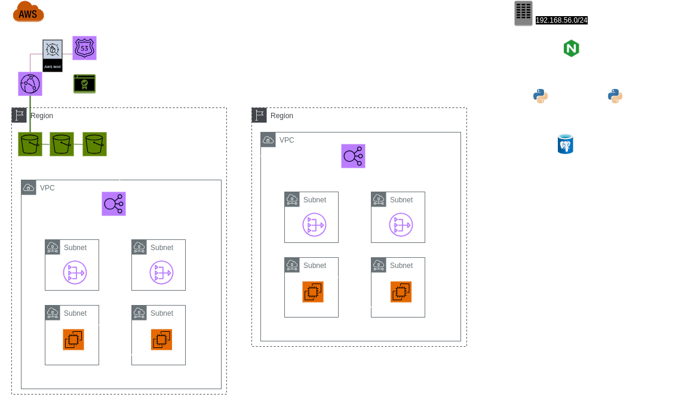

# Infrastructure as Code
La infrastructura como código (IaC) es una forma de gestión de la configuración que permite el manejo y el aprovisionamiento de recursos de cómputo y almacenamiento a través de archivos que son interpretables por una computadora. Estos archivos permiten acercar muchas ventajas al mundo de la configuración, como por ejemplo mantner un snapshot de la infrastructura en algún sistema de control de versiones, automatizar reglas y poder reproducir de manera fiable los amb ientes de desarrollo y producción.

En el siguiente repositorio se encuentra un ejemplo práctico que permite desplegar una arquitectura mixta entre local y cloud, utilizando como base herramientas de IaC.

## Prerrequisitos
Para ejecutar el proyecto, es necesario tener los siguientes módulos instalados de forma local:
- [`terraform`](https://www.terraform.io/), de (Hashicorp)
- [`vagrant`](https://www.vagrantup.com`) (Hashicorp)
- [`VirtualBox`](https://www.virtualbox.org/) (Oracle)
- Tener acceso a una cuenta de [AWS](https://aws.amazon.com/).

## Ejecución

### Despligue cloud
Para realizar el despliegue de la arquitectura en la nube, se deben realizar los siguientes pasos:

1. Configurar las credenciales de AWS en el archivo `~/.aws/credentials`.
2. Cambiar de directorio hacia `./terraform`.
3. Ejecutar el comando `terraform init`.
4. Ejecutar el comando `terraform plan -out plan.tfplan`.
5. Ejecutar el comando `terraform apply plan.tfplan`.

Esta serie de pasos realiza el despliegue. Es importante considerar que el mismo puede demorar unos minutos, ya que tiene que crear y configurar todos los recursos estipulados.

Una vez creados los recursos se los puede destruir ejecutando `terraform destroy`.

En secciones posteriores se incluye un mayor detalle de la utilización de `terraform`

### Despliegue *on-premise*
Para realizar el despliegue *on-premise*, se deben realizar los siguientes pasos:

1. Cambiar de directorio hacia `./vagrant`.
2. Ejecutar el comando `vagrant up`.

Es importante considerar que el mismo puede ddemorar unos minutos, ya que debe descargar las configuraciones y levantar una serie de máquinas virtuales.

Se puede pausar las máquinas virtuales utilzando el comando `vagrant halt`(equivalente a apagarlas) y se las puede destruir con el comando `vagrant destroy`.

En secciones posteriores se incluye un mayor detalle de la utilización de `vagrant`

## Arquitectura y tecnologías
Una vez ejecutado, obtenemos el despliegue de la siguiente arquitectura:

<p align="center">
  
</p>

Como vemos en el diagrama, la arquitectura tiene una parte en la nube y la otra parte *on-premise*. De forma local, encontramos dos instancias de una API detrás de un *load-balancer*, que impactan los cambios en una base de datos *Postgres*.

La infrstructura en la nube incluye un sitio web estático, y dos instancias de una API que está alojada en instancias EC2. Además, se provee una segunda región pasiva que actúa como failover en caso de fallas en la primera. Para mayor detalle de los módulos de AWS se puede consultar la siguiente sección.

## Terraform y AWS
Para el desarrollo de infraestructura cloud en AWS, utilizamos la herramienta Terraform.

Estructura del proyecto:

- **modules**: módulos reutilizables
    - *VPC*: módulo para desplegar una VPC y subredes en doble AZ, junto con las tablas de ruteo asociadas, NAT Gateway e Internet Gateway. Este módulo se reutiliza para replicar la arquitectura en dos regiones.
    - *API*: módulo para desplegar un ALB que toma como target group un autoscaling group de EC2's con una AMI sencilla. Estas EC2 se despliegan en las subnets privadas y simplemente sirven un html estático donde muestran su IP. Este módulo se reutiliza para replicar la arquitectura en dos regiones.
    - *S3*: módulo para desplegar un sitio web estático en un bucket de frontend, solamente accesible desde una distribución de Cloudfront. Se despliega con la arquitectura estándar de 3 buckets www - frontend - logs. El primero sólo redirige las requests al bucket del sitio estático (frontend).
    - *Cloudfront*: módulo para desplegar una distribución de Cloudfront, con el objetivo de acceder al sitio web estático con menor latencia.
    - *Route53*: módulo para desplegar los records de route53 en la hosted zone previamente creada. Se define una configuración de activo/pasivo para el módulo de api. Se toma como activo a la región us-east1.
    - *ACM*: módulo para desplegar los certificados SSL y sus validaciones del dominio propio utilizado.
    - *RDS*: módulo para desplegar una instancia de base de datos MySQL haciendo uso de un secret previamente creado en AWS Secret Manager.
    - *WAF*: módulo para desplegar una regla de AWS WAF que limita la cantidad de requests que puede recibir Cloudfront.
- **organization**:
    - *main.tf*: archivo principal donde se definen los módulos que se van a utilizar en la arquitectura. Es donde se decide reutilizar los módulos de vpc y api para replicar la api en dos regiones diferentes de amazon.
    - *providers.tf*: se configura el proveedor de nube.
    - *variables.tf*: se definen las variables a utilizar, como por ejemplo el dominio propio.
    - *versions.tf*: se definen las versiones de los providers y herramientas de terraform.
    

**Importante**: En el proyecto se asume que se han creado dos recursos previamente en AWS. Estos son una hosted zone con el dominio propio, la cual se creó anteriormente para reservar nameservers de aws y delegar la resolución del dominio comprado en nic.ar, y un secret con el nombre db_creds en AWS Secret Manager, el cual contiene credenciales de acceso para la base de datos RDS.

Ejemplo del secret db_creds:
```json
{
    "db_username": "<replace>"
    "db_password": "<replace>"
}
```

## Vagrant
Para el desarrollo on-premise utilizamos [`vagrant`](https://developer.hashicorp.com/vagrant/intro), una herramienta de código abierto para la creación y manejo de ambientes con máquinas virtuales.

Vagrant funciona de una forma similar a Terraform, en el sentido de que es preciso declarar un `provider` para la virtualización. Esto se debe a que el software de Vagrant en sí solo se encarga de orquestar la creación del ambiente virtual, pero no tiene la capacidad de crearlos. Vagrant soporta muchas opciones para el `provider`, entre las que están Hyper-V, VirtualBox e inclusive Docker. Por default (y el escogido para este proyecto) utiliza VirtualBox, ya que es de código abierto y está disponible en la mayoría de las plataformas.

### Vagrantfile
El núcleo de la configuración de Vagrant se encuentra en un archivo llamado [Vagrantfile](./vagrant/Vagrantfile). En el mismo se encuentra detallada de una manera muy declarativa toda la información de las máquinas virtuales. En un mismo Vagrantfile se puede detallar el despliegue de la cantidad de máquinas virtuales que sean necesarias.

El Vagrantfile permite utilizar definiciones programáticas, como por ejemplo ciclos, para levantar múltiples recursos de una forma sencilla.

### Vagrant boxes
Para levantar una máquina virtual, es preciso indicar el [*vagrant box*](https://developer.hashicorp.com/vagrant/docs/boxes) a utilizar. Los mismos describen cuál es la máquina virtual que se va a levantar, y se pueden encontrar varios en el [repositorio de Hashicorp](https://app.vagrantup.com/boxes/search) (aunque la documentación solo recomienda los de Hashicorp y los de [Bento](https://app.vagrantup.com/bento)). Para este proyecto, utilizaremos un *box* con [Ubuntu 22.04](https://app.vagrantup.com/bento/boxes/ubuntu-22.04), provisto por Bento.

### Provisioning
Además de poder elegir la *box* que mejor se adapte a nuestras necesidades, tenemos la opción de agregarle aprovisionamiento a nuestra máquina virtual. Es decir, que le podemos instalar el software que se requiera para que funciones de la forma en la que nosotros queremos. Esto se puede hacer pidiéndole a Vagrant que una vez arrancado el ambiente virtual ejecute un script de configuración en el que se instala todo lo requerido.

Estos aprovisionamientos se pueden definir para correrse siempre que la máquina se prende, o únicamente la primera vez que se despliega.

### Networking
Vagrant permite crear redes privadas para que se comuniquen las distintas máquinas virtuales como si fueran parte de una LAN. Se les puede asignar IPs estáticas, y también se las puede asignar con DHCP. Si se utilizan IPs estáticas, es importante que las mismas no coincidan con la IP algún otro servicio que podamos tener levantado en el ambiente local.

### Ejemplo
Veamos en concreto la definición para la máquina virtual que alojará a la base de datos. Primero, dentro del Vagrantfile tenemos los siguiente:

```
(1..2).each do |i|
    config.vm.define "api_#{i}" do |api|
      api.vm.hostname = "api-server"
      api.vm.box = "bento/ubuntu-22.04"
      api.vm.provision :shell, path: "./api/bootstrap.sh"
      api.vm.provision :shell, path: "./api/run.sh", run: "always"
      api.vm.network "private_network", ip: "192.168.56.#{i+1}0"
    end 
  end
```

Según lo expliado anteriormente, estamos levantando dos máquina virtuales idénticas (`api_1` y `api_2`) con la *box* de Ubuntu 22.04. Además tendrán IP `192.168.56.20` y `192.168.56.30`, y se aprovisionarán según lo estipulado en el archivo [`api/bootstrap.sh`](./vagrant/api/bootstrap.sh) que instala las dependencias necesarias. Además de este script, también tenemos el script [`api/run.sh](./vagrant/api/run.sh) que se ejecuta cada vez que la máquina se prende para levantar a la API.

Acá podemos ver el `db/bootstrap.sh`:
```bash
#!/bin/bash

apt-get update -y

apt-get install python3 -y
apt-get install python3-pip -y

echo 'Installing python dependencies...'
pip3 install uvicorn fastapi sqlalchemy psycopg2-binary
```

Y acá el  [`api/run.sh`](./vagrant/api/run.sh):
```bash
#!/bin/bash

echo 'Running api on port 80'
echo 'Logs at ~/api.log'
sudo python3 /vagrant/api/src/main.py >> api.log &
```

### Funcionamiento y manejo de las máquinas
Una vez que termina de desplegar la infrastructura, podemos ver el estado de las máquinas virtuales con el comando `vagrant status`:

```bash
user@host:~/vagrant$ vagrant status

Current machine states:

db                        running (virtualbox)
lb                        running (virtualbox)
api_1                     running (virtualbox)
api_2                     running (virtualbox)

This environment represents multiple VMs. The VMs are all listed
above with their current state. For more information about a specific
VM, run `vagrant status NAME`.
```

Obtenemos un resultado similar ejecutando el comando `vboxmanage list runningvms`, que nos muestra las máquinas virtuales que tiene corriendo VirtualBox:
```bash
user@host:~/vagrant$ vboxmanage list runningvms

"vagrant_db_1717626178648_59534" {af9db160-bd87-4aef-8269-70e78883c24d}
"vagrant_lb_1717626268147_91684" {a18c070b-a47c-410a-8e2f-19145d5a0a05}
"vagrant_api_1_1717627811598_91367" {be0c93f4-ea2a-419c-bf16-dcbbea609a18}
"vagrant_api_2_1717627925217_9835" {9b944847-d065-48fc-8863-f75565a66bf8}
```

Por último, podemos utilizar el comando `vg ssh` para conectarnos por SSH a alguna de las máquinas levantadas, por si es necesario ejecutar algo desde ahí:
```bash
user@host:~/vagrant$ vg ssh api_1              
Welcome to Ubuntu 22.04.4 LTS (GNU/Linux 5.15.0-102-generic x86_64)

 * Documentation:  https://help.ubuntu.com
 * Management:     https://landscape.canonical.com
 * Support:        https://ubuntu.com/pro

  System information as of Thu Jun  6 02:05:28 AM UTC 2024

  System load:  0.05126953125      Processes:             142
  Usage of /:   14.3% of 30.34GB   Users logged in:       0
  Memory usage: 32%                IPv4 address for eth0: 10.0.2.15
  Swap usage:   0%                 IPv4 address for eth1: 192.168.56.20


This system is built by the Bento project by Chef Software
More information can be found at https://github.com/chef/bento
vagrant@api-server:~$ ...
```
